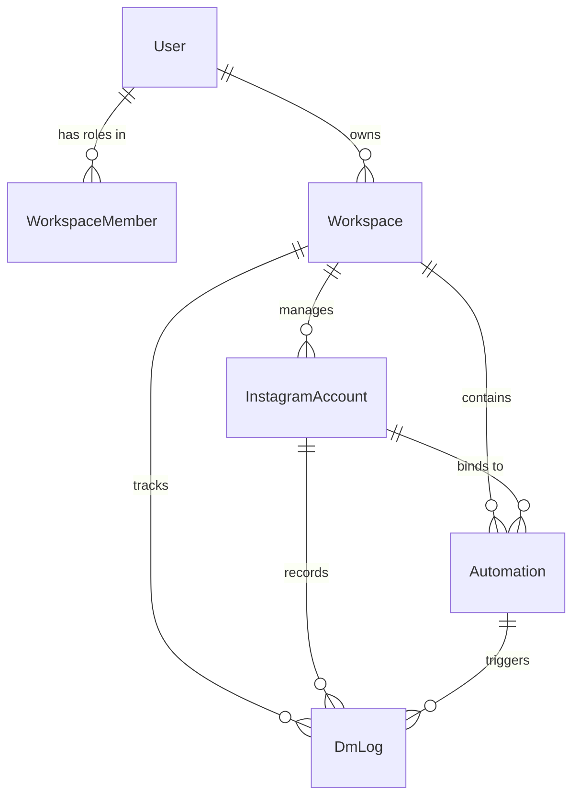
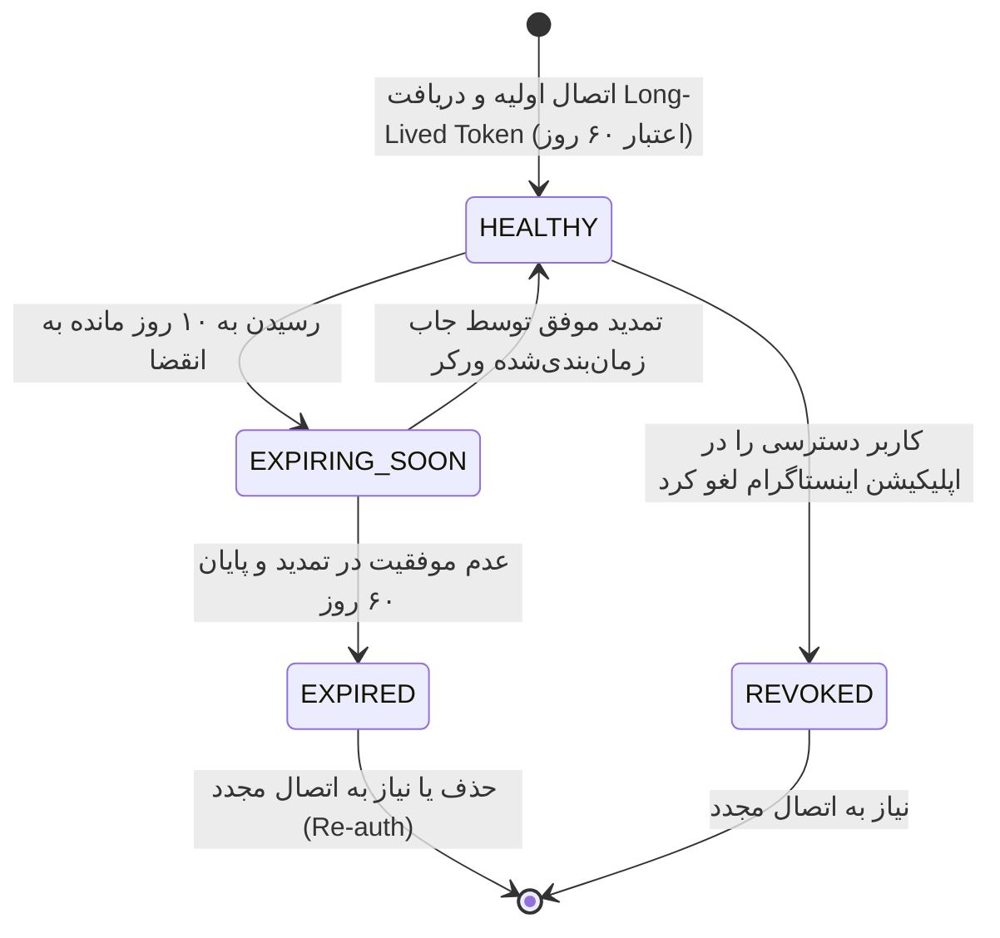
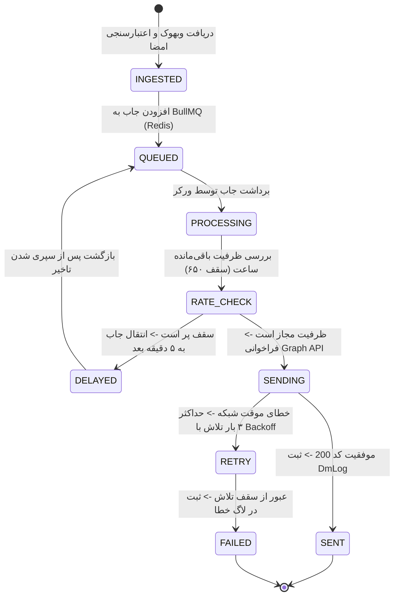

# مدل داده و رفتارهای سیستم (Phase 1: Data Model & State Transitions)
# ویژگی: `001-persian-rtl-instagram-automation`

این سند ساختار مدل‌های داده، روابط پایگاه داده (Prisma Schema)، اسکیمای اعتبارسنجی Zod و ماشین‌های وضعیت رخدادها را مشخص می‌کند.

---

## ۱. مدل داده پایگاه داده (Prisma Entities)



### ۱.۱. موجودیت اکانت اینستاگرام (`InstagramAccount`)
نگه‌داری اطلاعات اتصال رسمی اکانت‌های بیزینس اینستاگرام به ازای هر فضای کاری.

| فیلد | نوع داده | توضیحات و قواعد اعتبارسنجی |
| :--- | :--- | :--- |
| `id` | `String (cuid)` | کلید اصلی یکتای رکورد در دیتابیس |
| `workspaceId` | `String` | کلید خارجی ارجاع به جدول `Workspace` |
| `instagramId` | `String (unique)` | شناسه کاربری عددی رسمی متا (`user_id` یا `entry.id` در وب‌هوک) |
| `username` | `String` | نام کاربری بدون `@` (مانند `my_business`) |
| `name` | `String?` | نام نمایشی اکانت |
| `accessToken` | `String` | توکن دسترسی ۶۰ روزه رمزنگاری‌شده با `AES-256-GCM` |
| `tokenExpiresAt` | `DateTime?` | تاریخ دقیق پایان اعتبار توکن بلندمدت |
| `tokenStatus` | `TokenStatus` | وضعیت سلامت توکن: `HEALTHY`, `EXPIRING_SOON`, `EXPIRED`, `REVOKED` |
| `webhookSubscribed`| `Boolean` | آیا اکانت در `subscribed_apps` با موفقیت ثبت شده است؟ |
| `connectedAt` | `DateTime` | تاریخ اولین اتصال |
| `updatedAt` | `DateTime` | تاریخ آخرین تغییرات یا نوسازی توکن |

### ۱.۲. موجودیت کمپین اتوماسیون (`Automation` / `Campaign`)
تعریف قوانین تطبیق کامنت و سناریوی ارسال دایرکت خودکار.

| فیلد | نوع داده | توضیحات |
| :--- | :--- | :--- |
| `id` | `String (cuid)` | کلید اصلی |
| `workspaceId` | `String` | ارجاع به فضای کاری |
| `instagramAccountId`| `String` | ارجاع به اکانت اینستاگرام مجری کمپین |
| `name` | `String` | نام اختیاری کمپین برای سهولت مدیریت |
| `mediaId` | `String?` | شناسه پست یا ریلز مشخص (در صورت خالی بودن: تمام پست‌ها) |
| `isAllPosts` | `Boolean` | آیا کمپین روی تمام پست‌ها و ریلزها فعال است؟ |
| `keywords` | `String[]` | آرایه کلمات کلیدی فارسی/انگلیسی برای تحریک پاسخ |
| `matchingMode` | `MatchingMode` | حالت تطبیق: `EXACT` (کلمه کامل) یا `PARTIAL` (شامل شونده) |
| `dmMessage` | `String` | متن پیام خصوصی ارسالی (امکان استفاده از متغیر `{username}`) |
| `buttonTitle` | `String?` | متن دکمه لینک در دایرکت (حداکثر ۲۰ کاراکتر) |
| `buttonUrl` | `String?` | آدرس مقصد لینک |
| `publicReplies` | `String[]` | آرایه پاسخ‌های عمومی کامنت برای ارسال تصادفی زیر کامنت کاربر |
| `isPublicReplyEnabled`| `Boolean` | فعال یا غیرفعال بودن ارسال پاسخ عمومی |
| `isFollowGateEnabled` | `Boolean` | الزام به فالو داشتن پیج برای دریافت لینک |
| `isActive` | `Boolean` | وضعیت فعال بودن کلی کمپین |

### ۱.۳. موجودیت لاگ پیام‌ها (`DmLog`)
ثبت ریز وقایع ارسال‌ها برای ارزیابی نرخ موفقیت و خطایابی.

| فیلد | نوع داده | توضیحات |
| :--- | :--- | :--- |
| `id` | `String (cuid)` | شناسه لاگ |
| `workspaceId` | `String` | ارجاع به ورک‌اسپیس |
| `instagramAccountId`| `String` | شناسه اکانت |
| `automationId` | `String?` | کمپین فعال‌شده |
| `commentId` | `String` | شناسه کامنت ثبت‌شده در اینستاگرام (برای جلوگیری از پاسخ مکرر) |
| `commenterId` | `String` | شناسه کاربر کامنت‌گذار (IGSID) |
| `commenterUsername` | `String?` | نام کاربری کامنت‌گذار |
| `commentText` | `String` | متن کامنت گذاشته شده |
| `status` | `DmLogStatus` | وضعیت: `SENT`, `FAILED`, `RATE_LIMITED`, `DUPLICATE` |
| `errorMessage` | `String?` | متن خطای دریافتی از متا در صورت شکست |
| `sentAt` | `DateTime` | تاریخ و زمان ارسال |

---

## ۲. ماشین‌های وضعیت (State Transitions)

### ۲.۱. چرخه حیات سلامت توکن اینستاگرام (`TokenStatus`)



### ۲.۲. چرخه پردازش پیام دایرکت در صف (`BullMQ Job Flow`)



---

## ۳. طرح‌های اعتبارسنجی ورودی‌ها (Zod Schemas)

```typescript
import { z } from "zod";

// اسکیمای ایجاد یا ویرایش کمپین اتوماسیون
export const automationSchema = z.object({
  name: z.string().min(2, "نام کمپین باید حداقل ۲ کاراکتر باشد").max(60),
  instagramAccountId: z.string().cuid("اکانت انتخاب‌شده معتبر نیست"),
  mediaId: z.string().nullable().optional(),
  isAllPosts: z.boolean().default(false),
  keywords: z
    .array(z.string().min(1, "کلمه کلیدی نمی‌تواند خالی باشد"))
    .min(1, "حداقل یک کلمه کلیدی الزامی است"),
  matchingMode: z.enum(["EXACT", "PARTIAL"]).default("EXACT"),
  dmMessage: z.string().min(5, "متن دایرکت باید حداقل ۵ کاراکتر باشد").max(1000),
  buttonTitle: z.string().max(20, "عنوان دکمه نمی‌تواند بیش از ۲۰ کاراکتر باشد").optional(),
  buttonUrl: z.string().url("آدرس لینک نامعتبر است").optional(),
  publicReplies: z.array(z.string().max(300)).default([]),
  isPublicReplyEnabled: z.boolean().default(false),
  isFollowGateEnabled: z.boolean().default(false),
  isActive: z.boolean().default(true),
});

export type AutomationInput = z.infer<typeof automationSchema>;

// اسکیمای تغییر زبان کاربر
export const localeSchema = z.object({
  locale: z.enum(["fa", "en"]).default("fa"),
});
```
