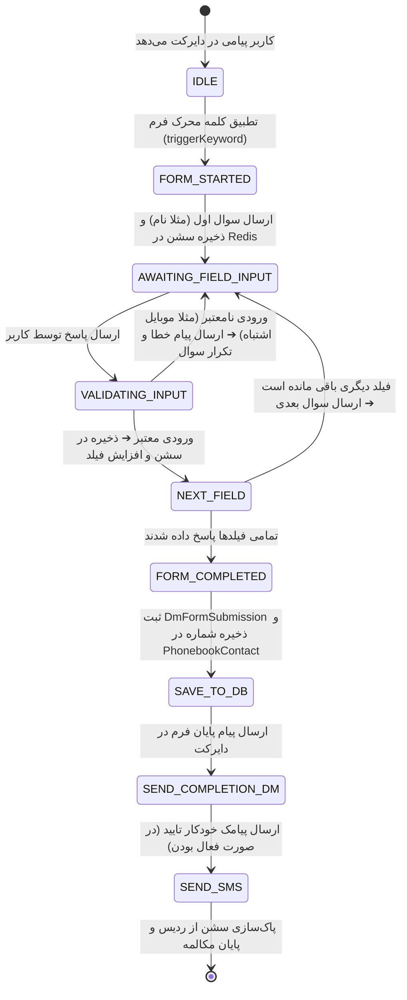
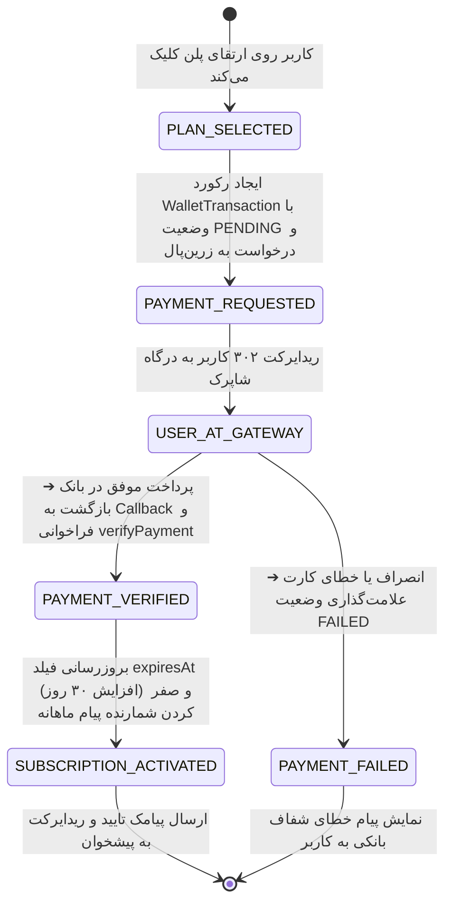

# مدل داده و ماشین‌های وضعیت (Data Model & State Transitions)
# ویژگی: `002-enterprise-growth-and-sales-suite`
# پلتفرم: دی‌رکت پرو (OpenReply Engine)

---

## ۱. ساختار موجودیت‌ها و اسکیما (Entity Definitions)

### ۱.۱. موجودیت اسناد پایگاه دانش هوش مصنوعی (`AiKnowledgeDoc`)
```prisma
model AiKnowledgeDoc {
  id          String    @id @default(cuid())
  workspaceId String
  title       String    // عنوان سوال یا دسته‌بندی، مثلا "هزینه و شرایط ارسال پستی"
  content     String    @db.Text // متن توضیحات و پاسخ کامل جهت تزریق به RAG
  isActive    Boolean   @default(true)
  createdAt   DateTime  @default(now())
  updatedAt   DateTime  @updatedAt

  workspace   Workspace @relation(fields: [workspaceId], references: [id], onDelete: Cascade)

  @@index([workspaceId])
  @@index([isActive])
}
```

### ۱.۲. به‌روزرسانی مدل اتوماسیون (`Automation`) برای استوری
```prisma
// افزودن فیلدهای زیر به مدل موجود Automation
model Automation {
  // ... فیلدهای موجود قبلی ...
  storyMentionEnabled Boolean  @default(false)
  storyMentionMessage String?  // متن دایرکت ارسالی در صورت تگ شدن در استوری
  storyReplyEnabled   Boolean  @default(false)
  storyReplyMessage   String?  // متن دایرکت ارسالی در صورت ریپلای روی استوری پیج
}
```

### ۱.۳. ساختار سوابق مالی و تراکنش‌ها (`WalletTransaction` - ارتقای منطقی)
* **نوع تراکنش (`TransactionType`):** `PLAN_PURCHASE` (خرید پلن)، `CREDIT_TOPUP` (شارژ دستی کیف پول).
* **وضعیت تراکنش (`TransactionStatus`):**
  * `PENDING`: کاربر به درگاه هدایت شده اما هنوز بازنگشته است.
  * `SUCCESS`: تایید پرداخت از سمت وب‌سرویس بانک دریافت شده و RefID ثبت گردیده است.
  * `FAILED`: تراکنش لغو شده، منقضی شده یا با خطای بانکی روبرو شده است.

---

## ۲. ماشین وضعیت گفتگوی چندمرحله‌ای دایرکت (DM Session State Machine)



### مشخصات اعتبارسنجی فیلدهای فرم:
1. **نوع `phone` (شماره موبایل ایران):**
   * الگوی اعتبارسنجی: `/^(\+98|0)?9\d{9}$/`
   * نرمال‌سازی: ارقام فارسی/عربی با `normalizeArabicScript` به ارقام انگلیسی تبدیل شده و به فرم استاندارد `09xxxxxxxxx` ذخیره می‌شوند.
2. **نوع `text` (متن آزاد / نام):**
   * حداقل ۲ کاراکتر، پاک‌سازی اموجی‌های اضافی و حداکثر ۱۰۰ کاراکتر.

---

## ۳. چرخه حیات تراکنش‌های مالی و اشتراک (Subscription Lifecycle)


